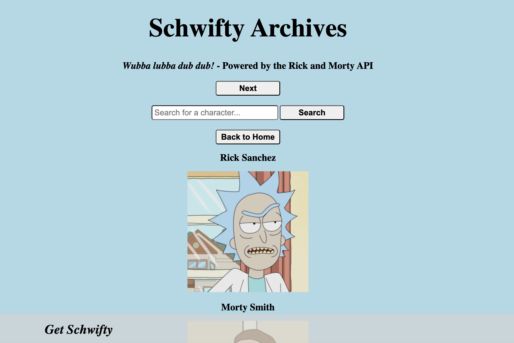
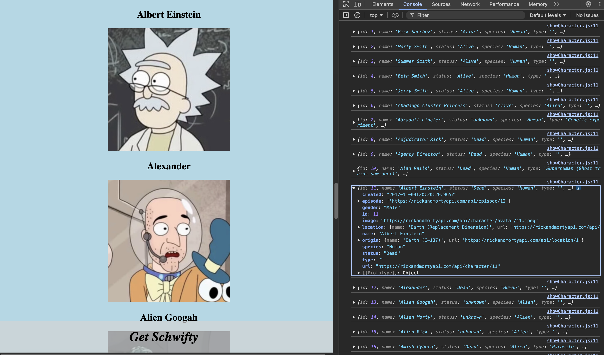
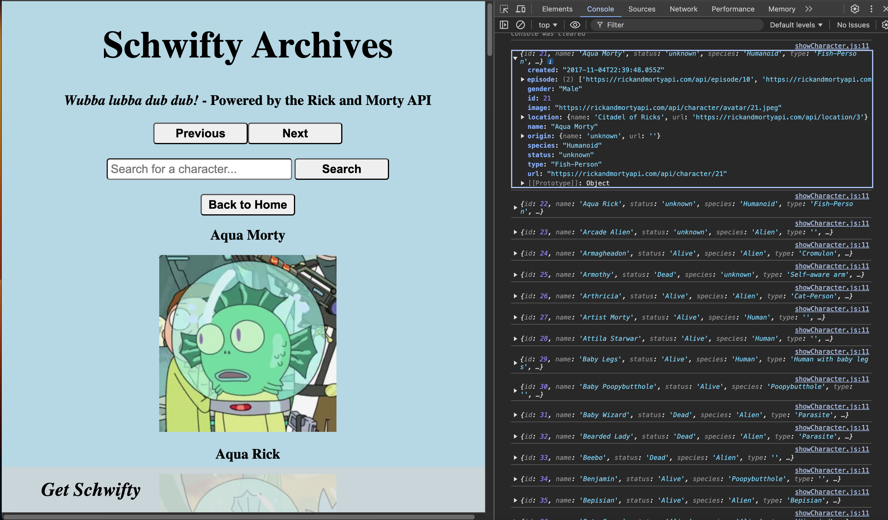
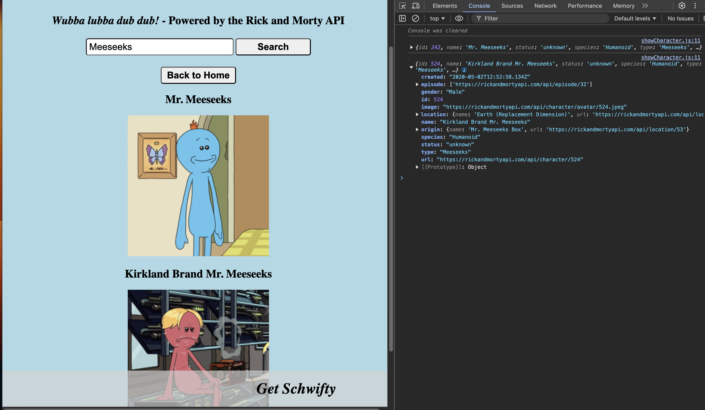
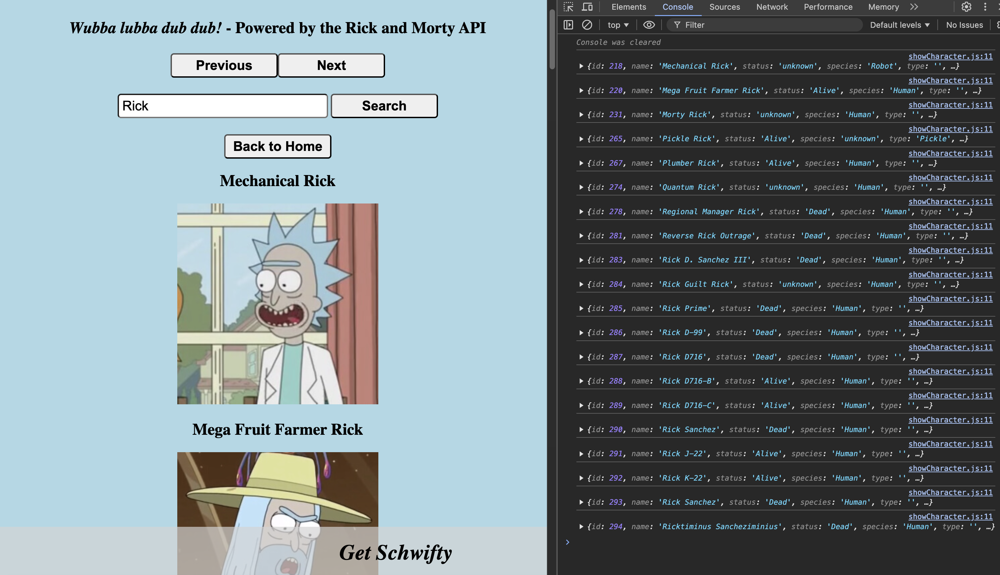

# Schwifty Archives
## Project 12: API App 

## Description: 
Welcome to my twelfth web development project! This is part of my coursework in The Odin Project, a free, open-source curriculum to learn fullstack web development! 

This project uses the Rick and Morty API to display characters from Rick and Morty, built using vanilla JS and CSS. The application features pagination (20 characters) and search functionality, allowing users to explore different characters from the show and filter results in real-time. 

The application is designed with modular JavaScript architecture, focusing on single responsibility for reach module. This approach ensure coad maintainability and scaalbility. Additionally, this application uses DOM manipulation to create an interactive user experience. For an added bonus, the application features a smooth ticker animation in the footer, created in CSS. 

While the prompt for this project was to create a weather app using the Weather API, I chose to use the Rick and Morty API for a unique application that utilized similar concepts. I hope you enjoy! 

## Links:
The full challenge description can be found here: https://www.theodinproject.com/lessons/node-path-javascript-weather-app

## Screenshots: 

